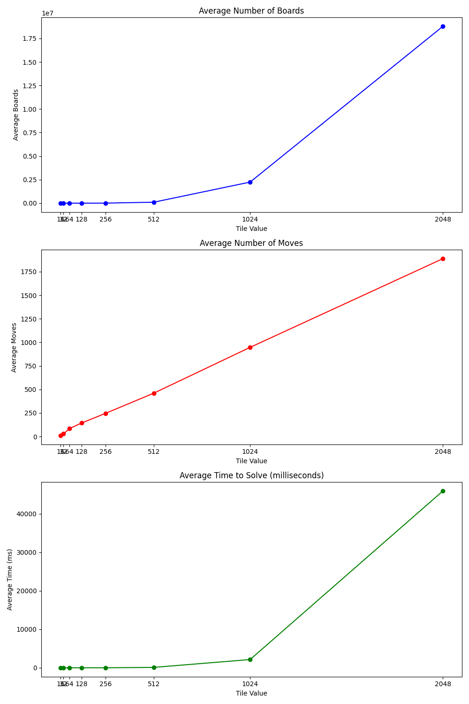

# Authors: Caleb L'Italien, Hope Crisafi
# CSC-320 Final Project
# Last Edited: 11/19/2023

# Abstract
- In the pursuit of exploring AI within constrained environments, this project explores the application of various heuristic algorithms to solve the 2048 game, a problem characterized by a vast state space and dynamic randomness. The algorithms in question include A* Search, Dijkstra's, Minimax, and Monte Carlo Tree Search. The adaptation from the initial proposal, which aimed for a minimum move win, to a heuristic approach stems from the practical limitations encountered during development. The achievements suggest the potential of AI in navigating complex problem spaces. This paper will present a comparative analysis of the algorithms based on efficiency, steps required to reach the highest tile achieved, and robustness in finding a solution, providing insights into the viability of each method within the constraints of limited computational resources. It also explores the limitations of Python and the reimplementation of the project in Rust.

# Introduction

- The game of 2048, a sliding block puzzle that has captured the interest of millions worldwide, presents a seemingly simple yet profoundly complex challenge: combine the tiles in a grid to eventually reach the elusive 2048 tile. Beyond its engaging gameplay, 2048 embodies a rich problem space that beckons the application of artificial intelligence, particularly heuristic algorithms designed to navigate vast and unpredictable state spaces. The convergence of game theory, heuristic search algorithms, and optimization against the backdrop of a popular game offers a ground for AI research, especially within the context of limited computational resources. Each of the algorithms tested carries a legacy of success in various applications, from pathfinding in robotics to decision-making in complex game environments. Here, they are repurposed and tested against the unpredictable dynamics of the 2048 game, with the goal of not just playing but excelling within its confines.
- The core challenge faced in this endeavor lies in the game's expansive state space — a nearly limitless array of possibilities that stem from the randomness of new tile placements. The initial proposal aimed to develop an AI capable of calculating the minimum number of moves to win the game. However, as development progressed, practical limitations necessitated a pivot in objectives. The focus shifted from achieving the minimum moves to evaluating the performance of each algorithm in terms of efficiency, the highest tile reached, and overall robustness in finding a solution.
- This paper delves into the theoretical underpinnings of each algorithm, the practical aspects of their implementation, and the nuances of their performance within the context of 2048. It explores the trade-offs between algorithmic complexity and resource efficiency, the balance of adaptability against predictability, and the overarching theme of AI ingenuity when confronted with the unexpected. Finally, it discusses the differences in success across programming languages, comparing the A* search algorithm's implementation in both Python and Rust. 

# Algorithms
A* Search
- The A* search algorithm is a pathfinding and graph traversal algorithm known for its efficiency and accuracy in finding the shortest path to a goal. This function initiates with a priority queue, open_set, to manage the exploration of board states, and employs a heuristic to estimate the cost from the current state to the goal. This heuristic considers factors like the number of empty cells, potential merges, tile monotonicity, and smoothness (how similar adjacent tile values are). It also prioritizes placing the highest-valued tile in a corner. The heuristic function calculates a negative score based on these criteria, with the goal of minimizing this score. States are compressed into a binary (see game_utils.py: compress_board, decompress, and reconstruct_path for more information on this; see also utils.py) format to optimize memory usage. The search proceeds by examining all possible moves from the current state, checking if the move is beneficial according to the heuristic, and then exploring further from these new states. The process continues until the goal state is reached or all possibilities are exhausted, indicating that no solution is found within the maximum search depth.
Monte Carlo Tree Search
- Monte Carlo Tree Search (MCTS) is a heuristic search algorithm for decision processes, most notably those used in game play. In the context of the 2048 game, MCTS is utilized to simulate gameplay paths and evaluate the most promising moves based on heuristic values. The monte_carlo_tree_search function accepts an initial board state and a target tile value to reach. It uses a rollout function to simulate the game by repeatedly making the best possible move. Each move's heuristic value considers the number of empty spaces, the value of the largest tile, and whether the largest tile is in a corner. This process iterates until the target tile is reached or it is determined that no solution is found.
Dijkstra Search
- Dijkstra Search uses the famous Dijkstra's Algorithm to search for a solution. It is traditionally used for finding the shortest path between nodes in a graph, which is applicable to various problems including pathfinding and network routing. In the 2048 game, the Dijkstra Search algorithm is adapted to explore the game space systematically. Unlike A* search, Dijkstra’s algorithm doesn’t use a heuristic; it’s an uninformed search algorithm that considers all possible moves equally and explores them based on the cost so far. This makes it thorough but potentially slower compared to heuristic-based methods. Each state of the game board is treated as a node in a graph, and the algorithm explores paths from the initial board state, expanding outwards to all possible moves. It keeps track of the number of moves taken (the cost) to reach each state. The algorithm continues until it either finds a solution (reaching the target tile) or exhausts all possibilities without finding one. In the context of 2048, the cost is typically the number of moves made, and the algorithm aims to minimize this cost to reach the target tile.
Minimax Search
- The Minimax algorithm is a decision rule used for minimizing the possible loss in a worst-case scenario (maximizing the minimum gain). In the 2048 game, Minimax Search is used to evaluate the possible future states of the game, predicting the consequences of moves several steps ahead. The algorithm operates by alternating between minimizing and maximizing player turns; in the context of 2048, these roles correspond to the player's moves and the game's addition of new tiles on the board. For each move, it evaluates all possible outcomes and chooses the move that leads to the state with the best evaluated score, using a heuristic similar to that in A* search but adapted for Minimax. The heuristic assesses board states based on factors like the number of empty cells, potential for merges, and overall tile distribution. The search depth is crucial in Minimax: deeper searches provide better foresight at the cost of increased computational complexity.
    
# Metrics
- The metrics used were the average number of moves made, and the time taken to solve.
    Average Number of Moves was calculated by running each algorithm to solve each tile value in increasing order, starting at 8 (ex. solve for 8, then 16, 32, etc...) and all the way up to 2048.  Each tile value was solved 100 times for each algorithm.  Then, the average moves per tile value was taken for each algorihtm.  This allowed us to compare the average moves per tile value against the different algorithms.  One of the challenges we faced was getting the Python implementation of these algorithms to solve for the 512, 1024, and 2048 tile values given the speed of the code (even after we compressed the operations to the bit-level), and the limited memory of the lab machines.  Given the constraints on the higher-value tiles, we were able to provide these metrics on a graph below.  

    - Average time was a little more dependent on the implementation.  Using NumPy arrays and bit representations brought down the average time to solve a great deal from the initial time, but even after all that it was quite a lengthy process.  

Rust Algorithm Implementation Performance
    As mentioned earlier, the same algorithms implemented in Rust could solve for any value an order of magnitude quicker.  We only had time to collect and analyze the data for the Rust implementation for A*, which is represented in the graph below:

    The success rate for the Rust algorithm implementation was 100%, meaning it was always able to find a solution.  The average number of moves appear to increase linearly with each increase in tile value, while the average number of boards and the average time to solve appear to increase exponentially.

# Self-Grade
- Scope/Challenge:
    - The 2048 game presents a significant challenge due to its expansive state space and the element of randomness with new tile placements. The problem is both interesting and complex, as it requires a balance of strategic foresight and adaptability to the unpredictability of the game. The goal of reaching the 2048 tile is simple to understand yet difficult to achieve, making it an ideal domain for testing various AI heuristic algorithms. The challenge was amplified by the initial target of achieving a win in the minimum number of moves, a goal that was later adapted to evaluate the performance of the algorithms more broadly due to practical constraints.
- Completion:
    - The project's initial objective was to develop an AI that could determine the minimum number of moves to win. While this goal was revised, the project still succeeded in implementing and analyzing several heuristic algorithms. The notable achievement was the implementation of the A* search algorithm in Rust, which performed exceptionally well, reaching the 2048 tile quickly and efficiently. The completion of the project is substantial, with the key highlight being the successful translation of the problem into a heuristic context and the comparative analysis of the algorithms.
- Implementation:
    - The AI techniques utilized were correctly chosen and appropriately implemented for the scope of the problem. The A* Search algorithm's bitpacking technique, Monte Carlo Tree Search's decision process, Dijkstra's algorithm's thoroughness, and Minimax's adversarial foresight were all well-suited to the 2048 game. The code is well-written and clear, with each algorithm's methodology and reasoning thoroughly documented. The Rust implementation of A* Search, in particular, showcased an efficient use of the language's performance capabilities, demonstrating the importance of language choice in AI implementations.
- Assessment/Analysis:
    - The assessment was conducted based on efficiency (measured by the time taken to reach the highest tile), the number of steps required to achieve the highest tile, and the robustness of each algorithm in consistently finding a solution. The A* Search implementation in Rust was a standout, achieving the 2048 tile rapidly and with high consistency. The comparative analysis provided a nuanced understanding of each algorithm's strengths and limitations within the constraints of the game. The findings contribute valuable insights into algorithm performance and suitability, which can inform future AI applications in similar problem spaces.
- Utility:
    - The project structure and framework established for the solution of the 2048 game not only stand as a testament to problem-solving with AI, but also hold substantial educational value for future classes engaging with algorithm design and AI development. This value is derived from several facets of the project's design and the inherent complexity of the 2048 game itself, which make it an ideal teaching tool.
    - Firstly, the problem at hand — the 2048 game — poses a challenge that is easy to understand yet difficult to master. It serves as an excellent device for illustrating the intricacies of algorithmic thinking and AI development. The game's simple rules mask a deep combinatorial challenge, ideal for students to explore heuristic algorithms' effectiveness and efficiency. The complexity of the problem ensures that it can be revisited with increasing levels of sophistication, allowing students to iteratively improve their solutions as they acquire more knowledge and skills.
    - The project's adaptability is a core component of its educational utility. The main.py file, crafted to work in tandem with a run.sh file, provides a user-friendly interface that allows students to engage with the framework with minimal setup. This design means that students can focus on the conceptual and creative aspects of algorithm development without being bogged down by the intricacies of the game's execution. This hands-on experience with command-line tools and script-based automation also imparts valuable practical skills that are highly transferable to real-world software development.
    - Furthermore, the general-purpose 2048 utilities file, game_2048.py, is highly reusable code. By offering a functional interface (optimized with parallelization when called for), it allows students to not be constrained by the underlying game mechanics. This file acts as a foundation upon which students can build diverse algorithmic solutions — ranging from simple heuristic approaches to complex neural networks — thus encouraging experimentation and innovation. The ability to compare different algorithms' performance on the same problem is a powerful learning mechanic, encouraging critical thinking and analytical skills.
    - In advocating for the inclusion of this project in future classes, it is important to highlight the balance it strikes between theory and practice. It allows for the application of theoretical concepts in a practical setting, a process that is crucial for learning. Students can see the tangible outcomes of abstract principles, which not only reinforces learning but also sparks curiosity and engagement. When students engage with this project, they confront the tangible limitations of computational resources firsthand. As they endeavor to reach higher tiles, they encounter the practical problems of space complexity, even when operating on sophisticated computing systems. This experience is invaluable as it bridges the gap between the theoretical space complexities often discussed in textbooks and the real limitations they impose on algorithmic design and performance.
    - Navigating these constraints requires a deep understanding of both the problem space and the available tools. Students learn to optimize the use of memory and processor time, which are crucial skills in a world where computational resources, although vast, are not infinite. The challenge of reaching higher tiles within these limitations is not a mere academic exercise but a reflection of real-world scenarios where efficiency and resource management can be critical.
    - Lastly, the project is inherently scalable. It can be used as a gentle introduction to algorithmic thinking for novices or as a complex challenge for advanced students to optimize and refine. Instructors can tailor the difficulty and focus of the project based on the class's level, making it a versatile tool in Union College’s curriculum.

# Conclusion
Initially, our goal was to minimize moves to win the game, but we quickly realized the need to pivot our strategy. Each algorithm – A* Search, Monte Carlo Tree Search, Dijkstra's, and Minimax – offered unique insights into the game's dynamics. 

We chose these algorithms because they were either learned about in class, or we had previous knowledge about them.  It was interesting to compare how effective heuristic-based search algorithms perform compared to uninformed-search, and decision rule. Towards the larger tile values, we needed to increase the amount of maximum iterations allowed to find a solution, because our algorithm kept returning "no solution found".  For example, we started with 10,000 for A*, then increased it to 100,000, then to 1,000,000.  While this caused the larger numbers to take longer to solve, it ended up getting about 0 to 2 solutions found per tile value, as compared to consistently outputting no solution found.  If our main implementation had been in Rust or we had more computing resources, we certainly would have had more accurate numbers for the top three tile values.  

When you compare the algorithm's performance to the performance of a human playing 2048, the AI might be faster than the human, but as for maximum tile value reached, it is probably as string as the average human. It rarely acheives the 1024 or 2048 tile, just like anyone who plays the game casually.  It can always solve for the lower tile values, up to 512, which most people typically can do.
